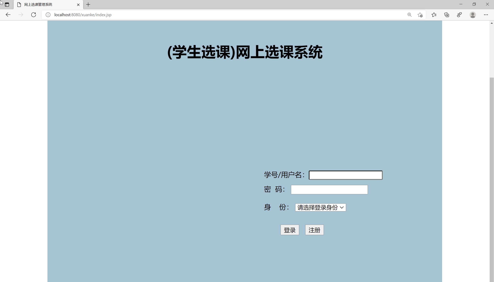
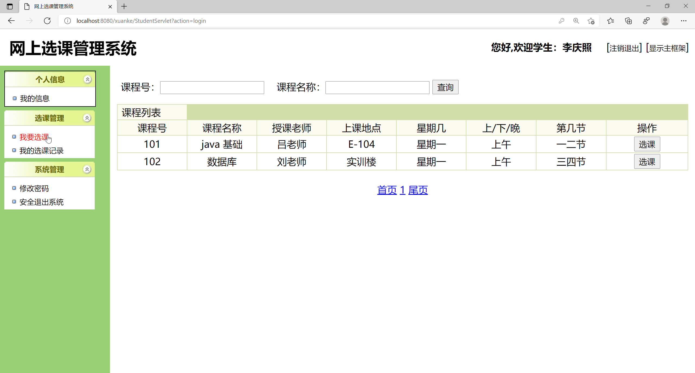

<h1 align="center">基于JSP+Servlet实现的网上选课系统</h1>

 获取sql文件 QQ: 3645296857 QQ群: 978300347 

<h4> 需要视频演示可联系上述QQ，私发视频链接 </h4>

 获取更多高质量源码，请访问：[mzoo源码网](https://mzoocodes.com/)

## 简介

> 本代码来源于网络,仅供学习参考使用!
>
> <b style="color: dodgerblue"> 提供1.远程部署/2.修改代码/3.定制程序/4.文档指导/5.框架代码讲解、技术解答、代码讲解等服务 </b>
>
> 前端地址：http://localhost:8080/xuanke/index.jsp
>
> 管理员: admin 密码: 123456
> 
> 教师：admin 密码：123456
> 
> 学生：10001 密码: 123456

## 项目介绍

基于JSP+Servlet实现的网上选课系统：前端 JSP、BootStrap、JQuery、Ajax，后端 Servlet、JDBC，系统角色分为：管理员、教师和学生。管理员在管理端管理用户信息，发布课程等；老师可以查看选课情况，筛选选课学生等；学生可以查看课程信息并选课等。主要功能如下：

### 管理员

- 基本操作：登录、注册、修改密码、退出系统
- 学生信息管理：获取学生信息列表、查看学生信息详情、修改学生信息、删除学生信息、筛选学生信息、添加学生
- 课程管理：获取课程信息列表、查看课程信息详情、修改课程信息、删除课程信息、筛选课程信息、添加课程
- 选课管理：获取选课信息列表、查看选课信息详情、修改选课信息、删除选课信息、筛选选课信息

### 教师

- 基本操作：登录、注册、修改密码、退出系统
- 学生信息管理：获取学生信息列表、查看学生信息详情、修改学生信息、删除学生信息、筛选学生信息、添加学生
- 课程管理：获取课程信息列表、查看课程信息详情、修改课程信息、删除课程信息、筛选课程信息、添加课程
- 选课管理：获取选课信息列表、查看选课信息详情、修改选课信息、删除选课信息、筛选选课信息

### 学生

- 基本操作：登录、注册、修改密码、退出系统、修改个人信息
- 选课管理：获取选课信息列表、查看选课信息详情、筛选选课信息、选课

## 环境

- <b>IntelliJ IDEA 2020.3</b>

- <b>Mysql 5.7.26</b>

- <b>Tomcat 9.0.41</b>

- <b>JDK 1.8</b>

## 运行截图

